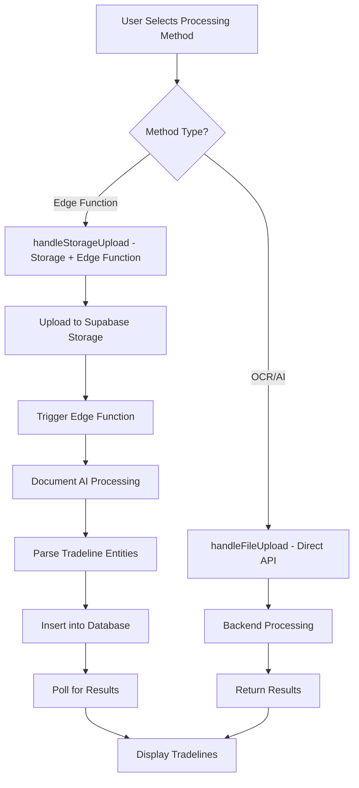

# Credit Clarity Edge Function Integration Guide

## 🎯 Overview

This guide documents the complete integration of the Google Document AI Edge Function with your existing Credit Clarity codebase. The integration provides a new **Edge Function (Document AI)** processing method alongside the existing OCR and AI methods.

## 📁 **Files Modified/Created**

### **New Files:**
1. **`frontend/supabase/functions/process-credit-report/`** - Complete Edge Function implementation
   - `index.ts` - Main Edge Function with Document AI integration
   - `jwt-helper.ts` - Google Cloud JWT authentication
   - `deno.json` - Deno configuration and dependencies
   - `README.md` - Detailed setup documentation

2. **`frontend/supabase/migrations/20250726_create_storage_setup.sql`** - Database schema updates
   - Creates `credit-reports` storage bucket
   - Adds RLS policies for file access
   - Links tradelines to credit reports via `credit_report_id`

3. **`deploy-edge-function.sh`** - Automated deployment script

### **Modified Files:**
1. **`frontend/src/components/credit-upload/FileUploadHandler.tsx`**
   - ✅ Added `handleStorageUpload()` method for Edge Function integration
   - ✅ Added `pollForTradelineResults()` helper for result polling
   - ✅ Exposed both upload methods in return object

2. **`frontend/src/components/credit-upload/ProcessingMethodSelector.tsx`**
   - ✅ Extended to support `'edge-function'` processing method
   - ✅ Added new button for Edge Function option

3. **`frontend/src/hooks/useCreditUploadState.ts`**
   - ✅ Updated interface to include `'edge-function'` type
   - ✅ Set `'edge-function'` as default processing method

4. **`frontend/src/pages/CreditReportUploadPageOld.tsx`**
   - ✅ Added `ProcessingMethodSelector` component
   - ✅ Conditional upload handler selection based on processing method
   - ✅ Imported and integrated all necessary components

## 🔧 **How It Works**

### **Integration Architecture:**



### **Processing Method Selection:**

1. **OCR (Fast)** - Uses existing backend OCR processing
2. **AI Analysis (Advanced)** - Uses existing backend AI processing  
3. **Edge Function (Document AI)** - NEW - Uses Supabase storage + Edge Function

### **Data Flow for Edge Function Method:**

1. **File Selection** → User chooses Edge Function method and selects PDF
2. **Storage Upload** → File uploaded to `credit-reports/{user_id}/{timestamp}-{filename}`
3. **Edge Function Trigger** → Manual trigger via `supabase.functions.invoke()`
4. **Document AI Processing** → Google Document AI extracts structured data
5. **Database Operations** → Creates credit report record + inserts tradelines
6. **Result Polling** → Frontend polls database for new tradelines
7. **UI Update** → Displays extracted tradelines with progress indicators

## 🚀 **Deployment Instructions**

### **1. Deploy the Edge Function:**

**Option A: Using the deployment script:**
```bash
./deploy-edge-function.sh
```

**Option B: Manual deployment:**
```bash
cd frontend
npx supabase functions deploy process-credit-report
```

✅ **Edge Function successfully deployed to:** https://supabase.com/dashboard/project/gywohmbqohytziwsjrps/functions

### **2. Configure Environment Variables in Supabase Dashboard:**
```bash
# Google Cloud Configuration
GOOGLE_CLOUD_PROJECT_ID=your_gcp_project_id
GOOGLE_CLOUD_LOCATION=us
DOCUMENT_AI_PROCESSOR_ID=your_processor_id
GOOGLE_APPLICATION_CREDENTIALS_JSON='{
  "type": "service_account",
  "project_id": "...",
  "private_key": "...",
  ...
}'
```

### **3. Setup Storage Bucket and Database:**

**Option A: Run the SQL script in Supabase SQL Editor:**
```sql
-- Copy and paste the contents of setup-storage-bucket.sql
-- into your Supabase Dashboard → SQL Editor
```

**Option B: Manual setup via Dashboard:**
- Go to Supabase Dashboard → Storage
- Create bucket named `credit-reports` 
- Set to private, 10MB limit, PDF files only
- Configure RLS policies for user access

## 🧪 **Testing the Integration**

### **Manual Testing Steps:**

1. **Frontend Test:**
   - Navigate to the credit report upload page
   - Select "Edge Function (Document AI)" processing method
   - Upload a PDF credit report
   - Verify progress indicators work correctly
   - Check that tradelines are extracted and displayed

2. **Database Verification:**
   ```sql
   -- Check credit reports table
   SELECT * FROM credit_reports ORDER BY created_at DESC LIMIT 5;
   
   -- Check tradelines with credit report linkage
   SELECT t.*, cr.id as report_id 
   FROM tradelines t 
   LEFT JOIN credit_reports cr ON t.credit_report_id = cr.id
   ORDER BY t.created_at DESC LIMIT 10;
   ```

3. **Storage Verification:**
   - Check Supabase Dashboard → Storage → credit-reports
   - Verify files are uploaded with correct metadata
   - Check file permissions and RLS policies

### **Error Scenarios to Test:**

1. **File Upload Failures** - Test with invalid file types/sizes
2. **Processing Timeouts** - Test with very large or complex PDFs
3. **Authentication Issues** - Test with unauthenticated users
4. **Google Cloud API Errors** - Test with invalid credentials

## 📊 **Monitoring and Debugging**

### **Frontend Debugging:**
- Check browser console for upload progress logs
- Look for `🚀`, `✅`, `❌` prefixed log messages
- Monitor network requests to Supabase Storage and Edge Function

### **Edge Function Debugging:**
- Check Supabase Dashboard → Edge Functions → Logs
- Look for detailed processing logs with timestamps
- Monitor Google Cloud Document AI usage metrics

### **Backend Integration:**
- Your existing backend services remain unchanged
- Edge Function processing runs independently
- Results integrate seamlessly with existing tradeline management

## 🔗 **Integration Points**

### **Frontend Integration:**
- **ProcessingMethodSelector** - User chooses processing method
- **FileUploadHandler** - Handles both existing and new upload methods
- **useCreditUploadState** - Manages processing method state
- **Existing UI Components** - All work seamlessly with new method

### **Database Integration:**
- **Existing tradelines table** - Extended with `credit_report_id` column
- **New credit_reports table** - Links reports to tradelines
- **Enhanced duplicate detection** - Continues to work as before

### **Backend Coexistence:**
- **Independent Processing** - Edge Function doesn't affect existing backend
- **Shared Database** - All methods write to same tradelines table
- **Consistent Data Format** - All methods produce compatible tradeline data

## 📈 **Benefits of This Integration**

1. **Enhanced Processing Options** - Users can choose optimal method for their needs
2. **Google Document AI Power** - Leverages advanced AI for better extraction accuracy
3. **Scalable Architecture** - Edge Functions scale automatically with usage
4. **Seamless UX** - New method integrates invisibly with existing UI
5. **Backwards Compatibility** - Existing methods continue to work unchanged
6. **Centralized Storage** - All uploaded files stored securely in Supabase

## 🛠️ **Maintenance and Updates**

### **Future Enhancements:**
- Add storage event triggers for automatic processing
- Implement webhooks for real-time progress updates
- Add batch processing for multiple files
- Enhance error handling and retry mechanisms

### **Monitoring Requirements:**
- Monitor Google Cloud Document AI usage and costs
- Track Edge Function execution times and errors
- Monitor storage usage and cleanup policies
- Watch for authentication token expiration

## ⚡ **Quick Start for Developers**

1. **Deploy**: Run `./deploy-edge-function.sh`
2. **Configure**: Set Google Cloud credentials in Supabase
3. **Test**: Upload a PDF using the new Edge Function method
4. **Monitor**: Check logs and database for successful processing

Your Credit Clarity application now supports three complementary processing methods, giving users flexibility while maintaining the robust architecture you've built!