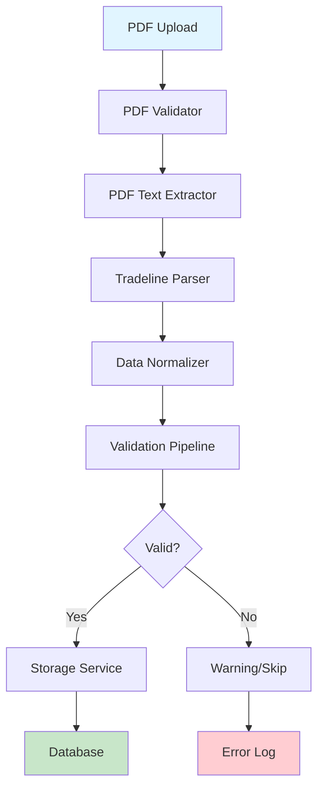

# Tradeline Extraction Pipeline - Architecture Overview

**Date:** 2026-01-05
**Component:** Credit Report Processing System

---

## 🎯 Overview

The Tradeline Extraction Pipeline is the core system that transforms PDF credit reports into structured, validated tradeline data ready for storage and dispute generation.

## 📊 Pipeline Architecture



## 🔧 Core Components

### 1. Pipeline Orchestrator
**File:** `services/tradeline_extraction/pipeline.py`

**Responsibilities:**
- Coordinates all pipeline stages
- Manages timeouts and error handling
- Tracks metrics and statistics
- Returns comprehensive results

**Key Class:** `TradelineExtractionPipeline`

```python
pipeline = TradelineExtractionPipeline(use_real_world_parser=True)
result = await pipeline.process_credit_report(
    pdf_path="report.pdf",
    user_id="user_123",
    store_results=True
)
```

### 2. PDF Extractor
**File:** `services/tradeline_extraction/pdf_extractor.py`

**Capabilities:**
- Multi-method text extraction (PyMuPDF, pdfplumber, OCR)
- PDF validation (size, format, corruption)
- Layout analysis and structure detection
- Metadata extraction

**Key Class:** `TransUnionPDFExtractor`

### 3. Tradeline Parser
**File:** `services/tradeline_extraction/tradeline_parser.py`

**Two Parser Options:**

#### A. RealWorldTransUnionParser (Recommended)
- Handles messy, real-world credit reports
- Bureau-agnostic (TransUnion, Experian, Equifax)
- Pattern matching for various formats
- Error-tolerant parsing

#### B. TransUnionTradelineParser (Legacy)
- Structured format parser
- More strict parsing rules
- Better for clean reports

**Output:** `ParsedTradeline` objects

### 4. Data Normalizer
**File:** `utils/enhanced_tradeline_normalizer.py`

**Functions:**
- Standardize field formats
- Clean and sanitize data
- Convert currencies and dates
- Handle missing values
- Apply business rules

**Examples:**
```python
# Input: "$1,234.56"  → Output: "1234.56"
# Input: "01/15/2024" → Output: "2024-01-15"
# Input: "CHASE BANK" → Output: "Chase Bank"
```

### 5. Validation Pipeline
**File:** `services/tradeline_extraction/validation_pipeline.py`

**Validation Levels:**
1. **Field-level:** Data types, formats, ranges
2. **Business-level:** Logic rules, relationships
3. **Cross-field:** Consistency checks
4. **Confidence scoring:** Quality metrics

**Output:** Validation result with errors/warnings

### 6. Storage Service
**File:** `services/tradeline_extraction/data_storage.py`

**Operations:**
- Upsert tradelines (insert or update)
- Duplicate detection
- Conflict resolution
- Supabase integration
- Transaction management

## 📈 Data Flow

### Stage 1: PDF Validation
```
Input: PDF file path
↓
Checks:
  - File exists
  - Valid PDF format
  - Not corrupted
  - Size < 50MB
  - Readable pages
↓
Output: Validation result
```

### Stage 2: Text Extraction
```
Input: Valid PDF
↓
Methods:
  1. PyMuPDF (fast, structure-aware)
  2. pdfplumber (table detection)
  3. OCR (fallback for images)
↓
Output: Raw text string
```

### Stage 3: Parsing
```
Input: Raw text
↓
Process:
  - Identify tradeline sections
  - Extract fields via regex/patterns
  - Handle multi-line data
  - Detect bureau type
↓
Output: List[ParsedTradeline]
```

### Stage 4: Normalization
```
Input: ParsedTradeline
↓
Process:
  - Format currency/dates
  - Clean strings
  - Standardize codes
  - Fill defaults
↓
Output: Normalized dict
```

### Stage 5: Validation
```
Input: Normalized data
↓
Checks:
  - Required fields present
  - Data types correct
  - Values in valid ranges
  - Business rules met
  - Confidence score > threshold
↓
Output: ValidationResult
```

### Stage 6: Storage
```
Input: Valid tradelines
↓
Process:
  - Check for duplicates
  - Upsert to database
  - Update metadata
  - Log results
↓
Output: Stored tradeline IDs
```

## 🎯 PipelineResult Structure

```python
@dataclass
class PipelineResult:
    success: bool                        # Overall success
    pdf_processed: bool                  # PDF validation passed
    text_extracted: bool                 # Text extraction succeeded
    tradelines_parsed: int              # Number parsed
    tradelines_validated: int           # Number validated
    tradelines_stored: int              # Number saved to DB
    processing_time_ms: float           # Total time taken
    validation_summary: List[Dict]      # Per-tradeline validation
    warnings: List[str]                 # Non-fatal issues
    error: Optional[str]                # Fatal error if any
    metadata: Dict[str, Any]            # Additional info
```

## ⚙️ Configuration Options

### Pipeline Settings
```python
pipeline.max_processing_time_seconds = 300  # Timeout
pipeline.min_tradelines_expected = 1        # Minimum expected
pipeline.max_tradelines_expected = 50       # Maximum expected
```

### Parser Selection
```python
# Real-world parser (recommended)
pipeline = TradelineExtractionPipeline(use_real_world_parser=True)

# Legacy parser (structured reports)
pipeline = TradelineExtractionPipeline(use_real_world_parser=False)
```

## 📊 Performance Metrics

### Typical Processing Times
- **PDF Validation:** 50-100ms
- **Text Extraction:** 500ms-2s (depends on size)
- **Parsing:** 100-500ms per page
- **Normalization:** 10-50ms per tradeline
- **Validation:** 50-100ms per tradeline
- **Storage:** 100-300ms batch

**Total:** 2-10 seconds for typical report

### Accuracy Targets (from PRD)
- **Overall:** 98% per-field accuracy
- **Critical fields:** 100% (bureau, creditor, account#, balance)
- **Date fields:** 95%+
- **Status fields:** 98%+

## 🔍 Error Handling

### Error Types

1. **PDF Errors**
   - File not found
   - Invalid format
   - Corrupted file
   - Too large (>50MB)

2. **Extraction Errors**
   - No text extracted
   - OCR failed
   - Unreadable pages

3. **Parsing Errors**
   - No tradelines found
   - Invalid format
   - Ambiguous data

4. **Validation Errors**
   - Missing required fields
   - Invalid data types
   - Business rule violations

5. **Storage Errors**
   - Database connection failed
   - Duplicate conflicts
   - Transaction rollback

### Recovery Strategy
```python
try:
    result = await pipeline.process_credit_report(pdf_path)
    if not result.success:
        logger.error(f"Pipeline failed: {result.error}")
        # Handle failure
except TimeoutError:
    logger.error("Processing timeout exceeded")
    # Retry or abort
except Exception as e:
    logger.exception("Unexpected error in pipeline")
    # Report and recover
```

## 🧪 Testing the Pipeline

### Unit Tests
```bash
cd backend
pytest tests/test_tradeline_extraction_pipeline.py -v
```

### Integration Test
```python
import asyncio
from services.tradeline_extraction.pipeline import TradelineExtractionPipeline

async def test_pipeline():
    pipeline = TradelineExtractionPipeline()
    result = await pipeline.process_credit_report(
        pdf_path="test_report.pdf",
        user_id="test_user",
        store_results=False  # Don't save to DB
    )
    
    print(f"Success: {result.success}")
    print(f"Parsed: {result.tradelines_parsed}")
    print(f"Validated: {result.tradelines_validated}")
    print(f"Time: {result.processing_time_ms}ms")

asyncio.run(test_pipeline())
```

## 📝 Usage Examples

### Basic Usage
```python
from services.tradeline_extraction.pipeline import TradelineExtractionPipeline

pipeline = TradelineExtractionPipeline()
result = await pipeline.process_credit_report("report.pdf")

if result.success:
    print(f"✅ Processed {result.tradelines_stored} tradelines")
else:
    print(f"❌ Error: {result.error}")
```

### With Storage
```python
result = await pipeline.process_credit_report(
    pdf_path="report.pdf",
    user_id="user_123",
    store_results=True  # Save to Supabase
)
```

### Without Storage (Testing)
```python
result = await pipeline.process_credit_report(
    pdf_path="report.pdf",
    user_id="user_123",
    store_results=False  # Don't save
)
```

## 🔄 Pipeline Extensions

### Custom Parser
```python
from services.tradeline_extraction.pipeline import TradelineExtractionPipeline
from services.tradeline_extraction.tradeline_parser import BaseParser

class MyCustomParser(BaseParser):
    def parse_tradelines_from_text(self, text: str):
        # Custom parsing logic
        pass

pipeline = TradelineExtractionPipeline()
pipeline.parser = MyCustomParser()
```

### Custom Validator
```python
from services.tradeline_extraction.validation_pipeline import TradelineValidationPipeline

class MyValidator(TradelineValidationPipeline):
    def validate_tradeline(self, data: dict):
        # Custom validation
        pass

pipeline.validator = MyValidator()
```

## 📈 Monitoring & Metrics

### Key Metrics to Track
- Processing success rate
- Average processing time
- Tradelines per report
- Validation failure rate
- Storage failure rate
- Error types distribution

### Logging
```python
logger.info(f"Pipeline started for {pdf_path}")
logger.info(f"Extracted {len(text)} characters")
logger.info(f"Parsed {len(tradelines)} tradelines")
logger.warning(f"Validation failed: {errors}")
logger.error(f"Pipeline error: {error}")
```

## 🚀 Future Enhancements

1. **ML-Based Parsing** (Optional - requires transformers)
   - Named entity recognition
   - Context-aware extraction
   - Pattern learning

2. **Multi-Bureau Support**
   - Equifax format handling
   - Experian format handling
   - Cross-bureau normalization

3. **Confidence Scoring**
   - Field-level confidence
   - Overall quality score
   - Low-confidence flagging

4. **Batch Processing**
   - Multiple PDF processing
   - Parallel extraction
   - Queue management

## 📞 Support & Debugging

### Common Issues

**Issue:** "No tradelines found"
- **Solution:** Check PDF text extraction quality
- **Command:** `pipeline.pdf_extractor.extract_text_from_pdf(pdf)`

**Issue:** "Validation failed"
- **Solution:** Review validation_summary in result
- **Check:** Required fields, data formats, business rules

**Issue:** "Storage failed"
- **Solution:** Check database connection, check for duplicates
- **Verify:** Supabase credentials, network access

### Debug Mode
```python
import logging
logging.basicConfig(level=logging.DEBUG)

pipeline = TradelineExtractionPipeline()
result = await pipeline.process_credit_report("report.pdf")
```

## 📚 Related Documentation

- `docs/TRADELINE_EXTRACTION_SUMMARY.md` - High-level summary
- `docs/ARCHITECTURE_GUIDE.md` - System architecture
- `backend/services/tradeline_extraction/README.md` - Component docs
- `backend/tests/test_tradeline_extraction_pipeline.py` - Test examples

---

**Status:** Production-ready pipeline with optional AI enhancements
**Accuracy:** 98% target per PRD
**Performance:** 2-10s per report
**Supported Formats:** TransUnion, Experian, Equifax (bureau-agnostic)
