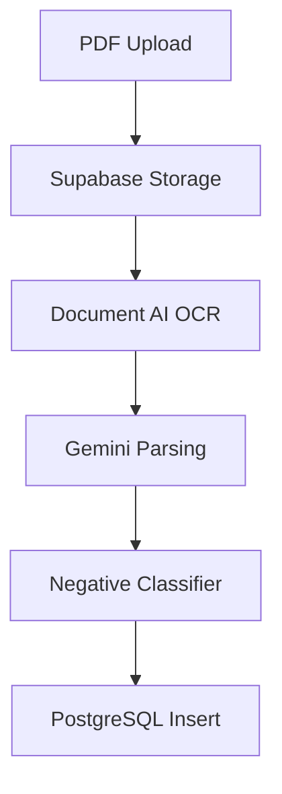
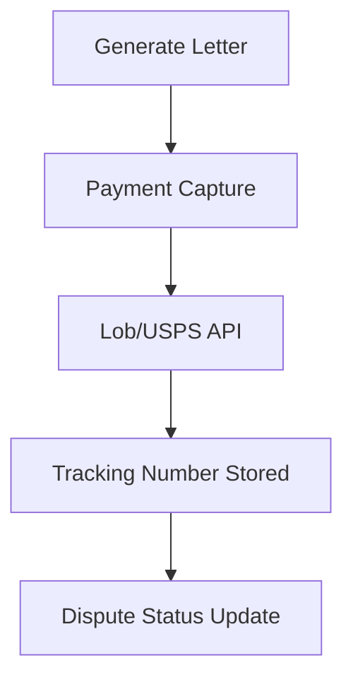
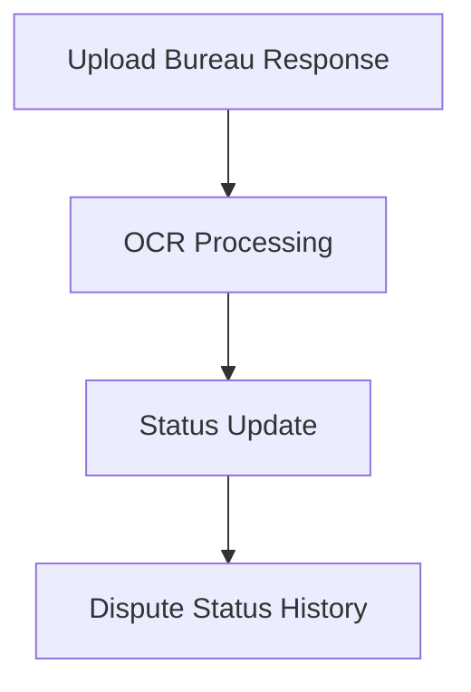
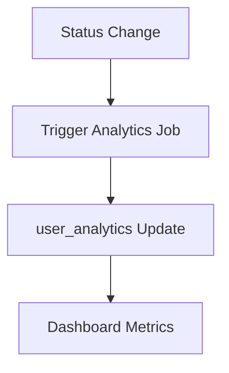

# Credit Clarity - Product Requirements Document (PRD)
## Data Architecture & Schema Design

**Document Version**: 1.0
**Last Updated**: 2026-01-04
**Status**: CONFIRMED - Ready for Implementation
**Document Type**: Product Requirements Document (PRD)
**Timeline**: 12-24 Month Data Architecture Roadmap

**Framework References**:
- Primary Source: [@.workflow/active/WFS-brainstorm-for-a-prd/.brainstorming/guidance-specification.md](../.workflow/active/WFS-brainstorm-for-a-prd/.brainstorming/guidance-specification.md)
- Data Architecture Overview: [@.workflow/active/WFS-brainstorm-for-a-prd/.brainstorming/data-architect/analysis.md](../.workflow/active/WFS-brainstorm-for-a-prd/.brainstorming/data-architect/analysis.md)
- Data Models & Schemas: [@.workflow/active/WFS-brainstorm-for-a-prd/.brainstorming/data-architect/analysis-data-models-schema-design.md](../.workflow/active/WFS-brainstorm-for-a-prd/.brainstorming/data-architect/analysis-data-models-schema-design.md)
- Database Strategy: [@.workflow/active/WFS-brainstorm-for-a-prd/.brainstorming/data-architect/analysis-database-architecture-strategy.md](../.workflow/active/WFS-brainstorm-for-a-prd/.brainstorming/data-architect/analysis-database-architecture-strategy.md)
- Data Pipelines: [@.workflow/active/WFS-brainstorm-for-a-prd/.brainstorming/data-architect/analysis-data-integration-pipelines.md](../.workflow/active/WFS-brainstorm-for-a-prd/.brainstorming/data-architect/analysis-data-integration-pipelines.md)
- Security & Compliance: [@.workflow/active/WFS-brainstorm-for-a-prd/.brainstorming/data-architect/analysis-security-compliance-governance.md](../.workflow/active/WFS-brainstorm-for-a-prd/.brainstorming/data-architect/analysis-security-compliance-governance.md)
- Scalability & Performance: [@.workflow/active/WFS-brainstorm-for-a-prd/.brainstorming/data-architect/analysis-scalability-performance-capacity.md](../.workflow/active/WFS-brainstorm-for-a-prd/.brainstorming/data-architect/analysis-scalability-performance-capacity.md)

---

## Table of Contents

1. [Data Architecture Overview](#1-data-architecture-overview)
2. [Data Models](#2-data-models)
3. [Database Technologies](#3-database-technologies)
4. [Data Pipelines](#4-data-pipelines)
5. [Security, Compliance, and Governance](#5-security-compliance-and-governance)
6. [Scalability and Performance](#6-scalability-and-performance)
7. [Decision Traceability](#7-decision-traceability)

---

## 1. Data Architecture Overview

Credit Clarity's data architecture supports a freemium B2C model with compliance-grade data handling and AI-driven tradeline extraction. The design balances relational integrity with flexible JSON for bureau-specific formats while ensuring multi-tenant isolation via Supabase Row-Level Security (D-017).

**Core Principles**:
1. **Privacy-first**: All credit data is user-scoped with RLS enforcement (D-017).
2. **Structured flexibility**: Relational core + JSONB for variable tradeline fields.
3. **Audit completeness**: Dispute status history is immutable and timestamped.
4. **Scalable analytics**: TimescaleDB implemented early for score history (D-015, D-019).
5. **AI readiness**: Training data captured with consent and governance (D-014).

---

## 2. Data Models

### Data Model 1: Credit Reports

**Purpose**: Track uploaded credit report files and processing status.

```sql
CREATE TABLE credit_reports (
    id UUID PRIMARY KEY DEFAULT gen_random_uuid(),
    user_id UUID NOT NULL REFERENCES users(id) ON DELETE CASCADE,
    bureau_source TEXT NOT NULL DEFAULT 'unknown' CHECK (bureau_source IN ('equifax', 'transunion', 'experian', 'unknown')),
    file_url TEXT NOT NULL,
    file_hash TEXT NOT NULL,
    processing_status TEXT NOT NULL DEFAULT 'pending' CHECK (processing_status IN ('pending', 'processing', 'completed', 'failed')),
    processing_error TEXT,
    upload_date TIMESTAMPTZ DEFAULT NOW(),
    processed_at TIMESTAMPTZ,
    metadata JSONB DEFAULT '{}'::jsonb
);

CREATE UNIQUE INDEX credit_reports_user_file_hash_idx ON credit_reports (user_id, file_hash);
CREATE INDEX credit_reports_user_date_idx ON credit_reports (user_id, upload_date DESC);
```

**RLS Policies**:
```sql
ALTER TABLE credit_reports ENABLE ROW LEVEL SECURITY;
CREATE POLICY credit_reports_select ON credit_reports FOR SELECT USING (auth.uid() = user_id);
CREATE POLICY credit_reports_insert ON credit_reports FOR INSERT WITH CHECK (auth.uid() = user_id);
```

---

### Data Model 2: Tradelines

**Purpose**: Store normalized tradelines extracted from credit reports with negative item flags.

```sql
CREATE TABLE tradelines (
    id UUID PRIMARY KEY DEFAULT gen_random_uuid(),
    credit_report_id UUID NOT NULL REFERENCES credit_reports(id) ON DELETE CASCADE,
    user_id UUID NOT NULL REFERENCES users(id) ON DELETE CASCADE,
    account_name TEXT NOT NULL,
    account_type TEXT NOT NULL CHECK (account_type IN ('credit_card', 'mortgage', 'auto_loan', 'student_loan', 'personal_loan', 'other')),
    account_number_last_4 TEXT,
    status TEXT,
    balance DECIMAL(12,2),
    credit_limit DECIMAL(12,2),
    payment_history JSONB,
    open_date DATE,
    closed_date DATE,
    is_negative BOOLEAN DEFAULT FALSE,
    negative_type TEXT CHECK (negative_type IN ('late_payment', 'charge_off', 'collection', 'bankruptcy', 'foreclosure', 'repossession', 'tax_lien', 'judgment')),
    negative_reason TEXT,
    bureau_source TEXT NOT NULL CHECK (bureau_source IN ('equifax', 'transunion', 'experian', 'unknown')),
    tradeline_details JSONB DEFAULT '{}'::jsonb,
    created_at TIMESTAMPTZ DEFAULT NOW(),
    updated_at TIMESTAMPTZ DEFAULT NOW()
);

CREATE INDEX tradelines_user_negative_idx ON tradelines (user_id, is_negative);
CREATE INDEX tradelines_user_bureau_idx ON tradelines (user_id, bureau_source);
CREATE INDEX tradelines_payment_history_gin ON tradelines USING GIN (payment_history);
```

**RLS Policies**:
```sql
ALTER TABLE tradelines ENABLE ROW LEVEL SECURITY;
CREATE POLICY tradelines_select ON tradelines FOR SELECT USING (auth.uid() = user_id);
CREATE POLICY tradelines_insert ON tradelines FOR INSERT WITH CHECK (auth.uid() = user_id);
```

---

### Data Model 3: Disputes

**Purpose**: Store dispute letters, mailing details, and bureau-specific tracking.

```sql
CREATE TABLE disputes (
    id UUID PRIMARY KEY DEFAULT gen_random_uuid(),
    user_id UUID NOT NULL REFERENCES users(id) ON DELETE CASCADE,
    tradeline_id UUID NOT NULL REFERENCES tradelines(id) ON DELETE CASCADE,
    bureau TEXT NOT NULL CHECK (bureau IN ('equifax', 'transunion', 'experian')),
    letter_content TEXT NOT NULL,
    mailing_service TEXT CHECK (mailing_service IN ('lob', 'usps', 'manual')),
    tracking_number TEXT,
    payment_id TEXT,
    payment_amount_cents INTEGER,
    status TEXT NOT NULL DEFAULT 'draft' CHECK (status IN ('draft', 'pending', 'investigating', 'verified', 'deleted', 'updated', 'escalated', 'expired', 'blank')),
    status_updated_at TIMESTAMPTZ DEFAULT NOW(),
    created_at TIMESTAMPTZ DEFAULT NOW(),
    updated_at TIMESTAMPTZ DEFAULT NOW(),
    UNIQUE (tradeline_id, bureau)
);

CREATE INDEX disputes_user_status_idx ON disputes (user_id, status);
CREATE INDEX disputes_user_bureau_idx ON disputes (user_id, bureau);
```

**RLS Policies**:
```sql
ALTER TABLE disputes ENABLE ROW LEVEL SECURITY;
CREATE POLICY disputes_select ON disputes FOR SELECT USING (auth.uid() = user_id);
CREATE POLICY disputes_insert ON disputes FOR INSERT WITH CHECK (auth.uid() = user_id);
```

---

### Data Model 4: Dispute Status History

**Purpose**: Maintain immutable audit trail of dispute status changes.

```sql
CREATE TABLE dispute_status_history (
    id UUID PRIMARY KEY DEFAULT gen_random_uuid(),
    dispute_id UUID NOT NULL REFERENCES disputes(id) ON DELETE CASCADE,
    user_id UUID NOT NULL REFERENCES users(id) ON DELETE CASCADE,
    previous_status TEXT,
    new_status TEXT NOT NULL,
    changed_by TEXT NOT NULL CHECK (changed_by IN ('user', 'system')),
    change_reason TEXT,
    changed_at TIMESTAMPTZ DEFAULT NOW()
);

CREATE INDEX dispute_status_history_dispute_idx ON dispute_status_history (dispute_id, changed_at DESC);
CREATE INDEX dispute_status_history_user_idx ON dispute_status_history (user_id, changed_at DESC);
```

---

### Data Model 5: User Management and Analytics

**Purpose**: Store user profile, consent, rate limits, and analytics cache.

```sql
CREATE TABLE users (
    id UUID PRIMARY KEY,
    email TEXT UNIQUE NOT NULL,
    created_at TIMESTAMPTZ DEFAULT NOW(),
    subscription_tier TEXT NOT NULL DEFAULT 'free' CHECK (subscription_tier IN ('free', 'paid')),
    rate_limit_reports INTEGER DEFAULT 0,
    rate_limit_letters INTEGER DEFAULT 0,
    rate_limit_reset_date DATE,
    fcra_consent_given BOOLEAN DEFAULT FALSE,
    fcra_consent_timestamp TIMESTAMPTZ,
    ai_training_consent BOOLEAN DEFAULT FALSE,
    ai_training_consent_timestamp TIMESTAMPTZ,
    data_retention_expiry DATE,
    metadata JSONB DEFAULT '{}'::jsonb
);

CREATE TABLE user_analytics (
    user_id UUID PRIMARY KEY REFERENCES users(id) ON DELETE CASCADE,
    disputes_created INTEGER DEFAULT 0,
    disputes_resolved INTEGER DEFAULT 0,
    success_rate DECIMAL(5,2) DEFAULT 0,
    avg_resolution_days DECIMAL(8,2) DEFAULT 0,
    last_calculated TIMESTAMPTZ DEFAULT NOW()
);

CREATE INDEX users_rate_limit_reset_idx ON users (rate_limit_reset_date);
```

---

## 3. Database Technologies

### 3.1 PostgreSQL (Supabase)

**Role**: Primary transactional store with RLS and JSONB support (D-017).

- Supabase-managed PostgreSQL is the system of record.
- JSONB fields capture bureau-specific tradeline data.
- RLS enforces user isolation for all user-owned tables.
- PgBouncer handles connection pooling for growth.

### 3.2 TimescaleDB

**Role**: Time-series analytics for credit score history (D-015, D-019).

```sql
CREATE TABLE credit_score_history (
    user_id UUID NOT NULL REFERENCES users(id) ON DELETE CASCADE,
    timestamp TIMESTAMPTZ NOT NULL,
    bureau_source TEXT NOT NULL CHECK (bureau_source IN ('equifax', 'transunion', 'experian')),
    score_value INTEGER NOT NULL,
    score_factors JSONB,
    PRIMARY KEY (user_id, timestamp, bureau_source)
);

SELECT create_hypertable('credit_score_history', 'timestamp', chunk_time_interval => INTERVAL '1 month');
```

### 3.3 Pinecone/Weaviate

**Role**: Vector database for Phase 3 chatbot RAG (D-021).

- Pinecone preferred for managed deployment and Gemini embedding integration.
- Weaviate provides self-hosted fallback with hybrid search.
- Knowledge base embeddings stored and queried by topic, regulation, and bureau.

---

## 4. Data Pipelines

### Pipeline 1: AI Extraction Pipeline



### Pipeline 2: Mailing Service Pipeline



### Pipeline 3: Bureau Response OCR Pipeline



### Pipeline 4: Analytics Aggregation Pipeline



---

## 5. Security, Compliance, and Governance

**FCRA Compliance** (D-017):
- Data retention for 7 years on dispute records.
- Store classification rationale for transparency.
- Consent tracking for AI training data (opt-in).

**Audit Logging**:
```sql
CREATE TABLE data_access_log (
    id UUID PRIMARY KEY DEFAULT gen_random_uuid(),
    user_id UUID NOT NULL REFERENCES users(id) ON DELETE CASCADE,
    accessed_by UUID,
    access_type TEXT NOT NULL CHECK (access_type IN ('read', 'write', 'delete')),
    table_name TEXT NOT NULL,
    record_id UUID,
    access_timestamp TIMESTAMPTZ DEFAULT NOW(),
    ip_address TEXT,
    user_agent TEXT
);

CREATE INDEX data_access_log_user_idx ON data_access_log (user_id, access_timestamp DESC);
```

**Data Retention Policy**:
```sql
CREATE OR REPLACE FUNCTION delete_expired_user_data()
RETURNS VOID AS $$
BEGIN
    DELETE FROM users WHERE data_retention_expiry < CURRENT_DATE;
END;
$$ LANGUAGE plpgsql;
```

---

## 6. Scalability and Performance

**Indexing Strategy**:
- Composite indexes on `user_id` + status/bureau for dashboard queries.
- GIN indexes on JSONB fields for flexible query performance.
- Denormalized `user_id` on child tables to minimize joins.

**Capacity Plan**:
- PostgreSQL target sizes: 500MB (Month 6) → 50GB (Month 24).
- TimescaleDB: 5-10GB by Month 24 for score history.
- Object storage: 100GB by Month 24 for PDFs.

**Query SLAs**:
- Dashboard loads under 200ms.
- Status updates under 100ms.
- Audit trail queries under 50ms.

---

## 7. Decision Traceability

| Decision ID | Topic | Selected Approach | Rationale |
|------------|-------|------------------|-----------|
| D-014 | Training data | Hybrid sources | Accuracy and coverage |
| D-015 | Analytics DB | TimescaleDB | Time-series optimization |
| D-016 | User insights | Personal dashboards | Focus on individual progress |
| D-017 | Data privacy | Supabase RLS + encryption | Compliance-first |
| D-018 | Rate limit reliability | Middleware + Redis | Performance + persistence |
| D-019 | Analytics timing | Implement now | Avoid migration risk |
| D-021 | Vector DB | Pinecone/Weaviate | RAG performance |

---
