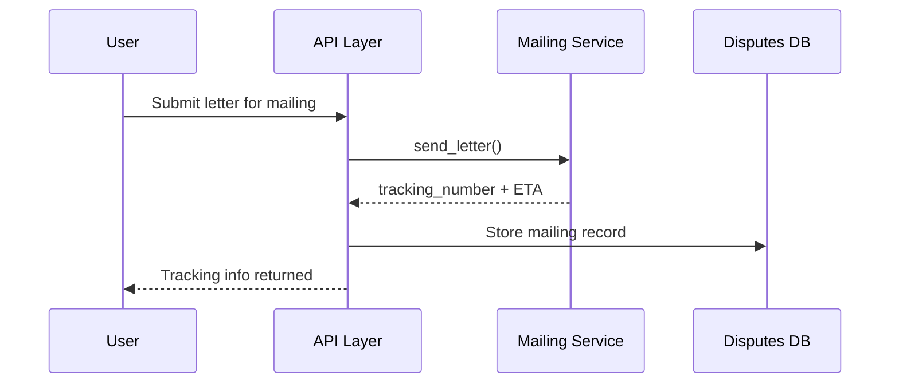
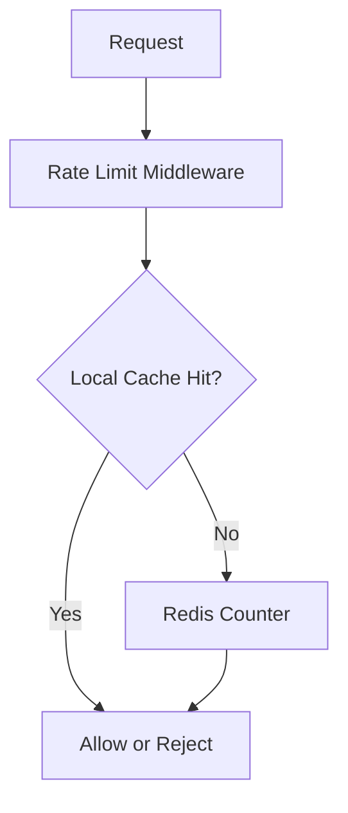
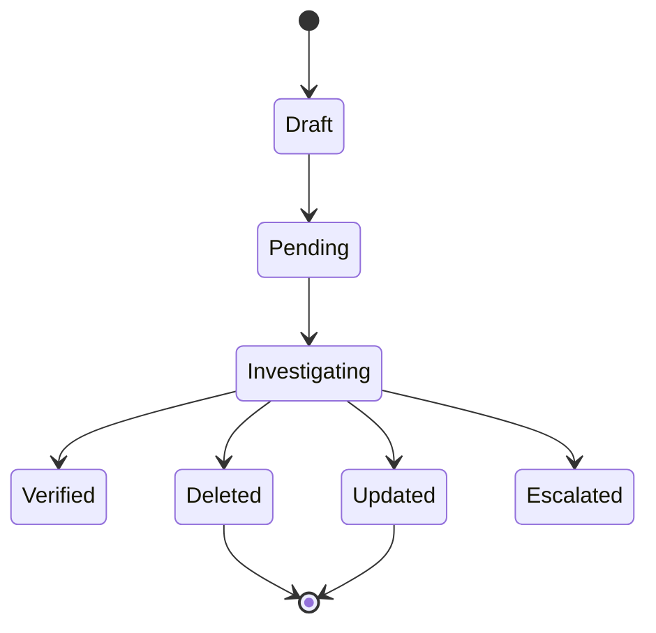
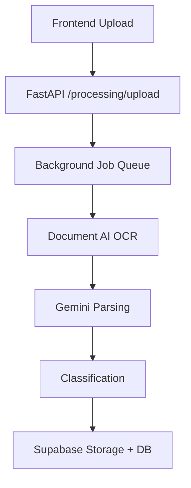
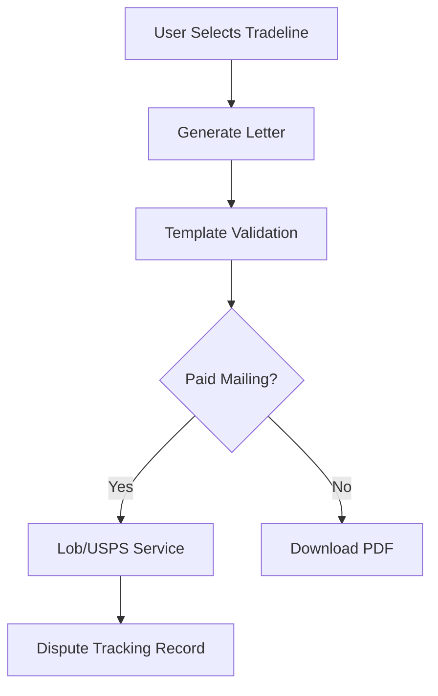

# Credit Clarity - Product Requirements Document (PRD)
## Technical Architecture & System Design

**Document Version**: 1.0
**Last Updated**: 2026-01-04
**Status**: CONFIRMED - Ready for Implementation
**Document Type**: Product Requirements Document (PRD)
**Timeline**: 12-24 Month Technical Architecture Roadmap

**Framework References**:
- Primary Source: [@.workflow/active/WFS-brainstorm-for-a-prd/.brainstorming/guidance-specification.md](../.workflow/active/WFS-brainstorm-for-a-prd/.brainstorming/guidance-specification.md)
- System Architecture Overview: [@.workflow/active/WFS-brainstorm-for-a-prd/.brainstorming/system-architect/analysis.md](../.workflow/active/WFS-brainstorm-for-a-prd/.brainstorming/system-architect/analysis.md)
- AI/ML Architecture: [@.workflow/active/WFS-brainstorm-for-a-prd/.brainstorming/system-architect/analysis-ai-ml-architecture.md](../.workflow/active/WFS-brainstorm-for-a-prd/.brainstorming/system-architect/analysis-ai-ml-architecture.md)
- Service Integration: [@.workflow/active/WFS-brainstorm-for-a-prd/.brainstorming/system-architect/analysis-service-integration.md](../.workflow/active/WFS-brainstorm-for-a-prd/.brainstorming/system-architect/analysis-service-integration.md)
- Data Infrastructure: [@.workflow/active/WFS-brainstorm-for-a-prd/.brainstorming/system-architect/analysis-data-infrastructure.md](../.workflow/active/WFS-brainstorm-for-a-prd/.brainstorming/system-architect/analysis-data-infrastructure.md)
- Data Architecture Strategy: [@.workflow/active/WFS-brainstorm-for-a-prd/.brainstorming/data-architect/analysis-database-architecture-strategy.md](../.workflow/active/WFS-brainstorm-for-a-prd/.brainstorming/data-architect/analysis-database-architecture-strategy.md)
- Data Security & Compliance: [@.workflow/active/WFS-brainstorm-for-a-prd/.brainstorming/data-architect/analysis-security-compliance-governance.md](../.workflow/active/WFS-brainstorm-for-a-prd/.brainstorming/data-architect/analysis-security-compliance-governance.md)

---

## Table of Contents

1. [Architecture Overview](#1-architecture-overview)
2. [Architecture Principles](#2-architecture-principles)
3. [Component Architecture](#3-component-architecture)
4. [Integration Patterns](#4-integration-patterns)
5. [Phase Architectures](#5-phase-architectures)
6. [Technology Stack & Rationale](#6-technology-stack--rationale)
7. [Architecture Decisions & Traceability](#7-architecture-decisions--traceability)
8. [Operational Considerations](#8-operational-considerations)

---

## 1. Architecture Overview

Credit Clarity is a modular, API-first platform that processes sensitive credit reports, extracts tradelines with AI, and orchestrates dispute workflows that require compliance-grade auditing. The architecture must satisfy speed-to-market goals (Phase 1 MVP) while enabling future scalability for AI features and multi-channel growth (Phases 2-4).

**Current Foundation** (Phase 3 modular architecture reference):
- API layer with versioned endpoints (`/api/v1`)
- Service layer for processing, business logic, and integrations
- Supabase PostgreSQL with RLS for multi-tenant security
- Background job support for large report processing

**Target State**:
1. AI/ML pipeline with explainable negative-item detection (D-010)
2. Mailing service abstraction (Lob -> USPS) for dispute delivery (D-012, D-020)
3. Hybrid rate limiting (middleware + Redis persistence) for freemium enforcement (D-013, D-018)
4. Multi-bureau tracking and dispute lifecycle management (D-016)
5. Security and compliance controls for FCRA and data governance (D-017)

---

## 2. Architecture Principles

1. **Compliance-first architecture**: FCRA data handling and auditing are first-class requirements (D-017).
2. **Explainable AI**: Classification and prediction must be auditable and explainable (D-010).
3. **Modular integration**: External providers are abstracted behind service interfaces (D-012, D-020).
4. **Hybrid scalability**: Build for rapid MVP delivery without sacrificing Phase 3+ scale (D-019).
5. **Data ownership**: Users control their data through RLS and consent tracking (D-017).

---

## 3. Component Architecture

### Component 1: AI/ML Pipeline (OCR -> Parsing -> Classification)

**Purpose**: Identify negative tradelines with 95%+ accuracy using a hybrid AI pipeline.

**Key Decisions**:
- Hybrid AI approach for parsing and classification (D-010, D-014)
- Phase 3 credit score prediction using rules + ML (D-010)
- Phase 3 chatbot using hybrid RAG + rules (D-011, D-021)

**Data Flow**:


**Implementation Sketch** (AI parsing + classification):
```python
async def process_credit_report(file_path: str, user_id: str) -> list[dict]:
    ocr_result = await document_ai.extract_text(file_path)
    tradelines = await gemini_parser.parse_tradelines(ocr_result.text)
    classified = [classifier.classify(t) for t in tradelines]
    return classified
```

**Operational Constraints**:
- OCR caching to reduce cost (24-hour cache)
- Low-temperature parsing for structured JSON output
- Confidence thresholds with user override for borderline cases

---

### Component 2: Mailing Service Integration (Lob -> USPS)

**Purpose**: Generate and deliver certified dispute letters with tracking and audit trails.

**Key Decisions**:
- Phase 1 uses Lob.com for rapid GTM (D-012, D-020)
- Phase 2 migration to USPS API Direct for cost optimization (D-012)

**Integration Pattern**:


**Service Abstraction Example**:
```python
class MailingServiceInterface(ABC):
    @abstractmethod
    async def send_letter(self, to_address, content, mail_type="certified"):
        pass

class LobMailingService(MailingServiceInterface):
    async def send_letter(self, to_address, content, mail_type="certified"):
        pdf_bytes = render_letter_pdf(content)
        response = lob_client.letters.create(file=pdf_bytes, extra_service="certified")
        return response.tracking_number
```

**Migration Strategy**:
1. Phase 1: Lob integration + operational telemetry
2. Phase 2: USPS Direct in parallel with A/B testing
3. Phase 2+ : Gradual cutover when cost and reliability targets met

---

### Component 3: Rate Limiting & Usage Enforcement

**Purpose**: Enforce freemium limits and protect system capacity while supporting viral growth.

**Key Decisions**:
- Middleware-based rate limiting for speed (D-013)
- Hybrid persistence with Redis to prevent resets (D-018)

**Architecture Pattern**:


**Implementation Sketch**:
```python
def enforce_rate_limit(user_id: str, route: str, limit: int) -> bool:
    local_key = f"{user_id}:{route}"
    if local_cache.has(local_key):
        return local_cache.increment(local_key) <= limit
    return redis_rate_limiter.check_and_increment(local_key, limit)
```

**Observability**:
- Emit limit counters for conversion analytics
- Log limit hits for freemium upgrade prompts

---

### Component 4: Multi-Bureau Tracking & Dispute Lifecycle

**Purpose**: Track disputes across Equifax, TransUnion, and Experian with status history.

**Key Decisions**:
- Multi-bureau tracking is core to user value (D-016)
- Status updates support manual entry + optional OCR (D-016)

**Data Model Snapshot**:
```sql
CREATE TABLE disputes (
    dispute_id UUID PRIMARY KEY,
    user_id UUID NOT NULL,
    tradeline_id UUID NOT NULL,
    bureau VARCHAR(20) NOT NULL,
    status VARCHAR(20) NOT NULL DEFAULT 'Draft',
    tracking_number VARCHAR(100),
    status_updated_at TIMESTAMP DEFAULT NOW(),
    UNIQUE (tradeline_id, bureau)
);
```

**Status Pipeline**:


---

### Component 5: Security, Compliance, and Auditability

**Purpose**: Protect sensitive credit data and enforce FCRA-required audit trails.

**Key Decisions**:
- Supabase RLS + column-level encryption (D-017)
- Data retention policies aligned to FCRA (D-017)

**Security Model**:


**Compliance Controls**:
```sql
ALTER TABLE tradelines ENABLE ROW LEVEL SECURITY;
CREATE POLICY "user_tradelines" ON tradelines
  FOR ALL USING (auth.uid() = user_id);

CREATE TABLE data_access_log (
    id UUID PRIMARY KEY DEFAULT gen_random_uuid(),
    user_id UUID NOT NULL,
    access_type TEXT NOT NULL,
    table_name TEXT NOT NULL,
    access_timestamp TIMESTAMPTZ DEFAULT NOW()
);
```

**Audit Requirements**:
- Store dispute letters and delivery tracking for 7 years
- Log AI classification rationale for transparency
- Capture consent timestamps for AI training opt-in

---

## 4. Integration Patterns

### 4.1 Credit Report Processing



### 4.2 Dispute Letter Workflow



### 4.3 Analytics & Status Tracking

```mermaid
flowchart TD
    A[Status Update] --> B[Dispute Status History]
    B --> C[User Dashboard Metrics]
    C --> D[TimescaleDB (Phase 3)]
```

---

## 5. Phase Architectures

## Phase 1: MVP Architecture (Months 1-6)

**Scope**:
- OCR + AI parsing pipeline (D-010)
- Lob.com mailing integration (D-012, D-020)
- Freemium rate limiting (D-013, D-018)
- Multi-bureau dispute tracking (D-016)

**Architecture Notes**:
- Single-region deployment with Supabase + FastAPI
- Background jobs for large report processing
- Feature flags for AI vs manual workflows

## Phase 2: Optimization Architecture (Months 7-12)

**Scope**:
- USPS API Direct integration (migration)
- Referral programs + growth analytics
- Rate limiting reliability and scaling

**Architecture Notes**:
- Mailing abstraction used to cut over providers
- Metrics pipeline for conversion optimization

## Phase 3: AI Enhancement Architecture (Months 13-18)

**Scope**:
- Credit score prediction engine (D-010)
- TimescaleDB analytics (D-015, D-019)
- RAG chatbot with vector DB (D-011, D-021)

**Architecture Notes**:
- Separate ML service or scheduled batch predictions
- Vector DB managed service for chatbot latency targets

## Phase 4: Scale & B2B Architecture (Months 19-24)

**Scope**:
- White-label multi-tenant controls
- Mobile app support with API expansion
- Advanced monitoring and incident response

**Architecture Notes**:
- Expanded auth roles, tenant-level RLS
- Load-testing and autoscaling strategies

---

## 6. Technology Stack & Rationale

| Layer | Technology | Rationale | Phase |
|------|------------|-----------|-------|
| API | FastAPI | Typed validation, async throughput | Phase 1 |
| Database | Supabase PostgreSQL | RLS + managed ops | Phase 1 |
| OCR | Google Document AI | 95%+ accuracy for reports | Phase 1 |
| NLP Parsing | Gemini 1.5 Pro/Flash | Structured extraction | Phase 1-2 |
| Caching | Redis | Rate limit persistence | Phase 1 |
| Mailing | Lob.com -> USPS | GTM then cost optimization | Phase 1-2 |
| Time-series | TimescaleDB | Historical credit score trends | Phase 3 |
| Vector DB | Pinecone/Weaviate | RAG chatbot retrieval | Phase 3 |

---

## 7. Architecture Decisions & Traceability

| Decision ID | Topic | Selected Approach | Rationale |
|------------|-------|------------------|-----------|
| D-010 | Score prediction | Hybrid rules + ML | Explainability with accuracy |
| D-011 | Chatbot | Hybrid RAG + rules | Cost control with quality |
| D-012 | Mailing integration | Lob first, USPS later | Faster GTM, later cost savings |
| D-013 | Rate limiting | Middleware layer | Low-latency enforcement |
| D-014 | Training data | Hybrid sources | Data coverage and accuracy |
| D-015 | Analytics DB | TimescaleDB | Time-series optimization |
| D-016 | User insights | Personal dashboards | Focus on individual progress |
| D-017 | Data privacy | Supabase RLS + encryption | Compliance-first |
| D-018 | Rate limit reliability | Middleware + Redis | Performance + persistence |
| D-019 | Analytics timing | Implement now | Avoid migration risk |
| D-020 | Mailing sequence | Lob -> USPS | GTM speed first |
| D-021 | Vector DB | Pinecone/Weaviate | RAG quality and scale |

---

## 8. Operational Considerations

**Observability**:
- Log OCR, parsing, and classification latency
- Track mailing success rates and delivery SLAs
- Monitor rate limiting thresholds for conversion signals

**Resilience**:
- Retry policies for external providers (OCR, mailing)
- Background job queue for long-running tasks
- Graceful degradation if OCR fails (manual upload fallback)

**Compliance**:
- Audit logs for data access and dispute actions
- Consent management for AI training data
- Data retention and deletion automation (7-year FCRA retention)

---
